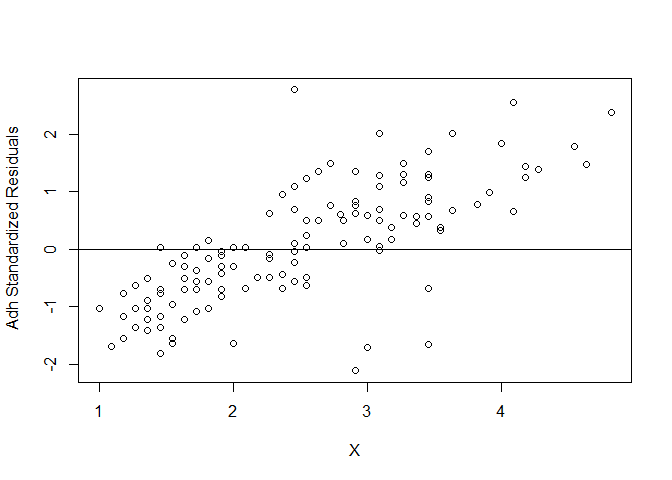

The effect of medication adherenec and seizure control on quality of
life
================
Joshua Edefo
2024-01-11

Libraries

``` r
library(ggplot2)
```

    ## Warning: package 'ggplot2' was built under R version 4.3.2

``` r
library(readr)
library(tidyverse)
```

    ## Warning: package 'tidyverse' was built under R version 4.3.2

    ## Warning: package 'forcats' was built under R version 4.3.2

    ## Warning: package 'lubridate' was built under R version 4.3.2

``` r
library(foreign)
```

    ## Warning: package 'foreign' was built under R version 4.3.2

import data,

``` r
ep <- read.csv("C:/Users/joe62/OneDrive - Aberystwyth University/Apps/Desktop/R code/ep.csv")
head(ep)
```

    ##   n_epil n_med      qol adh
    ## 1      2     3 3.909091   1
    ## 2      2     2 3.363636   3
    ## 3      1     1 2.545455   2
    ## 4      1     2 1.909091   5
    ## 5      0     2 2.454545   4
    ## 6      1     2 1.636364   5

``` r
str(ep)
```

    ## 'data.frame':    141 obs. of  4 variables:
    ##  $ n_epil: int  2 2 1 1 0 1 0 2 3 0 ...
    ##  $ n_med : int  3 2 1 2 2 2 2 2 3 2 ...
    ##  $ qol   : num  3.91 3.36 2.55 1.91 2.45 ...
    ##  $ adh   : int  1 3 2 5 4 5 3 4 4 7 ...

``` r
summary(ep)
```

    ##      n_epil           n_med            qol             adh        
    ##  Min.   : 0.000   Min.   :1.000   Min.   :1.000   Min.   : 1.000  
    ##  1st Qu.: 0.000   1st Qu.:2.000   1st Qu.:1.636   1st Qu.: 4.000  
    ##  Median : 1.000   Median :2.000   Median :2.455   Median : 6.000  
    ##  Mean   : 1.312   Mean   :2.085   Mean   :2.420   Mean   : 5.922  
    ##  3rd Qu.: 2.000   3rd Qu.:2.000   3rd Qu.:3.091   3rd Qu.: 8.000  
    ##  Max.   :11.000   Max.   :4.000   Max.   :4.818   Max.   :18.000

Regression modelling

``` r
# cheak for multicolinearity , and correlation of indepedent variables with dependent variable
cor(ep, method="pearson")
```

    ##             n_epil       n_med        qol         adh
    ## n_epil  1.00000000  0.06524041  0.5292356 -0.19102031
    ## n_med   0.06524041  1.00000000  0.1273141 -0.05600179
    ## qol     0.52923555  0.12731410  1.0000000 -0.47056220
    ## adh    -0.19102031 -0.05600179 -0.4705622  1.00000000

``` r
#n no multicolineraity
# correlaion between qol and n_med, and qol and adh not strong 

ep_2va= lm(qol~ n_epil, data = ep)
summary(ep_2va)
```

    ## 
    ## Call:
    ## lm(formula = qol ~ n_epil, data = ep)
    ## 
    ## Residuals:
    ##      Min       1Q   Median       3Q      Max 
    ## -2.03476 -0.62319 -0.06556  0.50423  1.95878 
    ## 
    ## Coefficients:
    ##             Estimate Std. Error t value Pr(>|t|)    
    ## (Intercept)  2.07774    0.07956  26.115  < 2e-16 ***
    ## n_epil       0.26056    0.03543   7.354 1.51e-11 ***
    ## ---
    ## Signif. codes:  0 '***' 0.001 '**' 0.01 '*' 0.05 '.' 0.1 ' ' 1
    ## 
    ## Residual standard error: 0.7667 on 139 degrees of freedom
    ## Multiple R-squared:  0.2801, Adjusted R-squared:  0.2749 
    ## F-statistic: 54.08 on 1 and 139 DF,  p-value: 1.511e-11

``` r
# result accepted as R-squared:  0.2801,    Adjusted R-squared:  0.2749,  p-value: 1.511e-11 

# assumming you want to use the independent variables in respective of their correlation with dependent variable
# independent variables, n_med, n_epil are correlated while n_epil and adh are also corellated, 
# so you can only choose one variable from all these in order to eliminate multicolinearity

ep_2va_ad= lm(qol~ adh, data = ep)
summary(ep_2va_ad)
```

    ## 
    ## Call:
    ## lm(formula = qol ~ adh, data = ep)
    ## 
    ## Residuals:
    ##     Min      1Q  Median      3Q     Max 
    ## -1.5266 -0.6348 -0.1339  0.6088  2.0442 
    ## 
    ## Coefficients:
    ##             Estimate Std. Error t value Pr(>|t|)    
    ## (Intercept)  3.40476    0.17047  19.973  < 2e-16 ***
    ## adh         -0.16636    0.02646  -6.287 3.91e-09 ***
    ## ---
    ## Signif. codes:  0 '***' 0.001 '**' 0.01 '*' 0.05 '.' 0.1 ' ' 1
    ## 
    ## Residual standard error: 0.7973 on 139 degrees of freedom
    ## Multiple R-squared:  0.2214, Adjusted R-squared:  0.2158 
    ## F-statistic: 39.53 on 1 and 139 DF,  p-value: 3.909e-09

``` r
# not accepted as Multiple R-squared:  0.2214 (not upto 0.25),  Adjusted R-squared:  0.2158, even though p-value: 3.909e-09
# this is because correlation between qol and adh is less than 0.5

# using n_med as independent variable
ep_2va_med= lm(qol~ n_med, data = ep)
summary(ep_2va_med)
```

    ## 
    ## Call:
    ## lm(formula = qol ~ n_med, data = ep)
    ## 
    ## Residuals:
    ##      Min       1Q   Median       3Q      Max 
    ## -1.42707 -0.76563 -0.03836  0.66384  2.41619 
    ## 
    ## Coefficients:
    ##             Estimate Std. Error t value Pr(>|t|)    
    ## (Intercept)   1.9882     0.2949   6.742 3.84e-10 ***
    ## n_med         0.2069     0.1367   1.513    0.132    
    ## ---
    ## Signif. codes:  0 '***' 0.001 '**' 0.01 '*' 0.05 '.' 0.1 ' ' 1
    ## 
    ## Residual standard error: 0.8963 on 139 degrees of freedom
    ## Multiple R-squared:  0.01621,    Adjusted R-squared:  0.009131 
    ## F-statistic:  2.29 on 1 and 139 DF,  p-value: 0.1325

``` r
# not accepted as R-squared:  0.01621,  Adjusted R-squared:  0.009131,  p-value: 0.1325 not significant


# conducting multiple regerssionusing all variables
ep_reg_all<- lm(qol~ n_epil+ adh + n_med,  data = ep)
summary(ep_reg_all)
```

    ## 
    ## Call:
    ## lm(formula = qol ~ n_epil + adh + n_med, data = ep)
    ## 
    ## Residuals:
    ##      Min       1Q   Median       3Q      Max 
    ## -1.24063 -0.47158 -0.06335  0.49309  1.76177 
    ## 
    ## Coefficients:
    ##             Estimate Std. Error t value Pr(>|t|)    
    ## (Intercept)  2.66397    0.27633   9.640  < 2e-16 ***
    ## n_epil       0.22236    0.03247   6.848 2.31e-10 ***
    ## adh         -0.13434    0.02330  -5.765 5.18e-08 ***
    ## n_med        0.12443    0.10537   1.181     0.24    
    ## ---
    ## Signif. codes:  0 '***' 0.001 '**' 0.01 '*' 0.05 '.' 0.1 ' ' 1
    ## 
    ## Residual standard error: 0.6886 on 137 degrees of freedom
    ## Multiple R-squared:  0.4276, Adjusted R-squared:  0.4151 
    ## F-statistic: 34.11 on 3 and 137 DF,  p-value: < 2.2e-16

``` r
# results R-squared:  0.4276,   Adjusted R-squared:  0.4151, p-value: < 2.2e-16

# conducting mutiple regression without n_med since it is the least correlated
ep_reg_a<- lm(qol~ n_epil+ adh,  data = ep)
summary(ep_reg_a)
```

    ## 
    ## Call:
    ## lm(formula = qol ~ n_epil + adh, data = ep)
    ## 
    ## Residuals:
    ##      Min       1Q   Median       3Q      Max 
    ## -1.26813 -0.47811 -0.02319  0.47563  1.75194 
    ## 
    ## Coefficients:
    ##             Estimate Std. Error t value Pr(>|t|)    
    ## (Intercept)  2.92786    0.16277  17.987  < 2e-16 ***
    ## n_epil       0.22449    0.03247   6.915 1.60e-10 ***
    ## adh         -0.13556    0.02331  -5.815 4.03e-08 ***
    ## ---
    ## Signif. codes:  0 '***' 0.001 '**' 0.01 '*' 0.05 '.' 0.1 ' ' 1
    ## 
    ## Residual standard error: 0.6896 on 138 degrees of freedom
    ## Multiple R-squared:  0.4218, Adjusted R-squared:  0.4134 
    ## F-statistic: 50.33 on 2 and 138 DF,  p-value: < 2.2e-16

``` r
# accepted result R-squared:  0.4218,   Adjusted R-squared:  0.4134, p-value: < 2.2e-16
# not for large no of independent variables use Adjusted R-squared in order to resolve over fitting
```

Best regression model

``` r
ep_reg_a<- lm(qol~ n_epil+ adh,  data = ep)
summary(ep_reg_a)
```

    ## 
    ## Call:
    ## lm(formula = qol ~ n_epil + adh, data = ep)
    ## 
    ## Residuals:
    ##      Min       1Q   Median       3Q      Max 
    ## -1.26813 -0.47811 -0.02319  0.47563  1.75194 
    ## 
    ## Coefficients:
    ##             Estimate Std. Error t value Pr(>|t|)    
    ## (Intercept)  2.92786    0.16277  17.987  < 2e-16 ***
    ## n_epil       0.22449    0.03247   6.915 1.60e-10 ***
    ## adh         -0.13556    0.02331  -5.815 4.03e-08 ***
    ## ---
    ## Signif. codes:  0 '***' 0.001 '**' 0.01 '*' 0.05 '.' 0.1 ' ' 1
    ## 
    ## Residual standard error: 0.6896 on 138 degrees of freedom
    ## Multiple R-squared:  0.4218, Adjusted R-squared:  0.4134 
    ## F-statistic: 50.33 on 2 and 138 DF,  p-value: < 2.2e-16

``` r
anova(ep_reg_a)
```

    ## Analysis of Variance Table
    ## 
    ## Response: qol
    ##            Df Sum Sq Mean Sq F value    Pr(>F)    
    ## n_epil      1  31.79  31.790  66.846 1.704e-13 ***
    ## adh         1  16.08  16.080  33.812 4.030e-08 ***
    ## Residuals 138  65.63   0.476                      
    ## ---
    ## Signif. codes:  0 '***' 0.001 '**' 0.01 '*' 0.05 '.' 0.1 ' ' 1

``` r
# qol = 2.92786 + 0.2245n_epil - 01356adh + u
# R-squared:  0.4276 means that 42.8% variation of qol can be explained by n_epil and adh while 
# the remaining 57.2 are explained by other variable hence the  disturbance term (u)

confint(ep_reg_a, level = 0.95)
```

    ##                  2.5 %      97.5 %
    ## (Intercept)  2.6060019  3.24970973
    ## n_epil       0.1602976  0.28868982
    ## adh         -0.1816611 -0.08946554

``` r
# results 

# when adh is constant
#qol = 2.92786 (SD= 0.1609) + 0.2245(SD=0.0321)n_epil 

# when adh is constant at 95% CI
#qol = (2.6060019 to 3.24970973) + (0.1602976 to 0.28868982)n_epil 

# when n_eph is constant
#qol = 2.92786 (SD= 0.1609) - 0.13556(SD=0.0230)n_epil 

# when adh is constant at 95% CI
#qol = (2.6060019 to 3.24970973) + (-0.1816611 -0.08946554)n_epil 
```

Residuals

``` r
standard.res <- rstandard(ep_reg_a)
standard.res
```

    ##           1           2           3           4           5           6 
    ##  0.98514746  0.57539495 -0.49324905 -0.82341714  0.10081529 -1.22057246 
    ##           7           8           9          10          11          12 
    ##  0.03563230 -0.68689579  0.57798864 -0.10182702 -0.95812213 -0.56097139 
    ##          13          14          15          16          17          18 
    ## -0.50392149 -0.02173512  0.17448550 -0.22691265 -0.02910650  1.83511735 
    ##          19          20          21          22          23          24 
    ## -0.76472982 -0.76472982 -0.95812213  0.02853346 -0.29945142 -0.30229482 
    ##          25          26          27          28          29          30 
    ##  2.02523955 -0.43188637  0.50510482 -1.65649401  0.70139478  2.54975395 
    ##          31          32          33          34          35          36 
    ##  0.50043393  1.09436465  0.02642034  2.77609888  1.78643260  0.70139478 
    ##          37          38          39          40          41          42 
    ##  1.29724373 -1.55306614  0.23375179  1.16235946 -0.68805560  0.49809727 
    ##          43          44          45          46          47          48 
    ## -0.49956870 -1.35527288 -0.23769402  0.58314712 -1.03637645 -1.71254131 
    ##          49          50          51          52          53          54 
    ## -0.16505769 -1.16086475 -1.41948960 -1.02989094  0.76286443 -1.03637645 
    ##          55          56          57          58          59          60 
    ## -1.03637645  1.38551824  1.44612003 -0.49324905 -1.22057246  0.82974841 
    ##          61          62          63          64          65          66 
    ## -0.42858780  0.32844550 -0.69426243  1.09344338 -0.63703523  0.62709042 
    ##          67          68          69          70          71          72 
    ## -1.02725094  0.03364731  1.22655712 -0.16692094 -0.95812213  0.84222005 
    ##          73          74          75          76          77          78 
    ## -0.62104189 -0.68608488 -1.03130127  0.17938311  1.49240948  0.66210531 
    ##          79          80          81          82          83          84 
    ##  0.04651461 -1.36148613  0.10081529 -0.36698814 -1.08818735 -1.16247150 
    ##          85          86          87          88          89          90 
    ##  0.37709042 -1.63084445 -0.36698814  2.02306432 -0.69708786  0.69365634 
    ##          91          92          93          94          95          96 
    ## -0.56454238 -0.69890739 -0.63703523  1.49278459  1.35967086  1.29239876 
    ##          97          98          99         100         101         102 
    ##  0.50237742 -0.77014897  0.02853346  1.25188012 -1.63751663  0.76549776 
    ##         103         104         105         106         107         108 
    ##  0.90421827 -1.81250760  2.37833743  1.46954714  0.38441683  0.60597397 
    ##         109         110         111         112         113         114 
    ##  0.10610106 -1.22057246 -0.55430295 -1.69151959  0.63281904 -0.22691265 
    ##         115         116         117         118         119         120 
    ##  0.50043393 -1.55885588 -0.49214335  0.44512013 -0.89731038 -0.69335497 
    ##         121         122         123         124         125         126 
    ## -1.22288929  0.69365634  0.03075354 -0.09640841  0.78476077  0.58166356 
    ##         127         128         129         130         131         132 
    ##  1.29744697  1.35655914 -0.89731038 -0.49956870 -0.29620422  0.16164720 
    ##         133         134         135         136         137         138 
    ## -0.49084115 -2.11500175  0.96032964 -0.03392433 -0.10458028 -1.03637645 
    ##         139         140         141 
    ##  1.69715615  0.66950497  1.25549744

``` r
# column bind standardised residuals back to original data
final.data <- cbind(ep,standard.res)
final.data
```

    ##     n_epil n_med      qol adh standard.res
    ## 1        2     3 3.909091   1   0.98514746
    ## 2        2     2 3.363636   3   0.57539495
    ## 3        1     1 2.545455   2  -0.49324905
    ## 4        1     2 1.909091   5  -0.82341714
    ## 5        0     2 2.454545   4   0.10081529
    ## 6        1     2 1.636364   5  -1.22057246
    ## 7        0     2 2.545455   3   0.03563230
    ## 8        2     2 2.363636   4  -0.68689579
    ## 9        3     3 3.454545   4   0.57798864
    ## 10       0     2 1.909091   7  -0.10182702
    ## 11       1     2 1.545455   7  -0.95812213
    ## 12       1     2 1.818182   7  -0.56097139
    ## 13       0     2 1.363636   9  -0.50392149
    ## 14       2     3 3.090909   2  -0.02173512
    ## 15       1     1 3.000000   2   0.17448550
    ## 16       1     3 2.454545   4  -0.22691265
    ## 17       1     2 2.454545   5  -0.02910650
    ## 18       1     3 4.000000   3   1.83511735
    ## 19       0     2 1.454545   7  -0.76472982
    ## 20       0     2 1.454545   7  -0.76472982
    ## 21       1     3 1.545455   7  -0.95812213
    ## 22       0     1 1.727273   9   0.02853346
    ## 23       0     1 1.909091   6  -0.29945142
    ## 24       0     2 1.636364   8  -0.30229482
    ## 25       0     2 3.090909   9   2.02523955
    ## 26       0     2 2.363636   2  -0.43188637
    ## 27       1     2 3.090909   3   0.50510482
    ## 28      10     2 3.454545   5  -1.65649401
    ## 29       1     2 3.090909   4   0.70139478
    ## 30       1     2 4.090909   6   2.54975395
    ## 31       1     4 2.818182   5   0.50043393
    ## 32       1     3 3.090909   6   1.09436465
    ## 33       0     2 1.454545  11   0.02642034
    ## 34       1     3 2.454545  18   2.77609888
    ## 35       3     3 4.545455   2   1.78643260
    ## 36       1     2 3.090909   4   0.70139478
    ## 37       0     1 3.272727   4   1.29724373
    ## 38       1     2 1.545455   4  -1.55306614
    ## 39       0     1 2.545455   4   0.23375179
    ## 40       1     3 3.272727   5   1.16235946
    ## 41       2     2 2.090909   6  -0.68805560
    ## 42       1     2 2.545455   7   0.49809727
    ## 43       0     2 1.636364   7  -0.49956870
    ## 44       1     2 1.272727   7  -1.35527288
    ## 45       0     2 1.545455   9  -0.23769402
    ## 46       4     2 3.000000   9   0.58314712
    ## 47       0     2 1.000000   9  -1.03637645
    ## 48       6     2 3.000000   1  -1.71254131
    ## 49       0     2 2.272727   4  -0.16505769
    ## 50       0     2 1.454545   5  -1.16086475
    ## 51       1     2 1.363636   6  -1.41948960
    ## 52       0     2 1.272727   7  -1.02989094
    ## 53       1     1 2.727273   7   0.76286443
    ## 54       0     1 1.000000   9  -1.03637645
    ## 55       0     2 1.000000   9  -1.03637645
    ## 56       3     2 4.272727   2   1.38551824
    ## 57       3     2 4.181818   3   1.44612003
    ## 58       1     2 2.545455   2  -0.49324905
    ## 59       1     2 1.636364   5  -1.22057246
    ## 60       1     2 2.909091   6   0.82974841
    ## 61       1     2 1.909091   7  -0.42858780
    ## 62       6     2 3.545455   7   0.32844550
    ## 63       3     2 1.909091   9  -0.69426243
    ## 64       0     2 2.454545   9   1.09344338
    ## 65       0     2 1.272727   9  -0.63703523
    ## 66       0     1 2.272727   8   0.62709042
    ## 67       1     1 1.363636   8  -1.02725094
    ## 68       1     2 2.090909   8   0.03364731
    ## 69       0     1 2.545455   9   1.22655712
    ## 70       1     2 1.818182   9  -0.16692094
    ## 71       1     2 1.545455   7  -0.95812213
    ## 72       1     2 3.454545   2   0.84222005
    ## 73       2     2 2.545455   3  -0.62104189
    ## 74       5     2 3.454545   1  -0.68608488
    ## 75       0     3 1.818182   3  -1.03130127
    ## 76       3     3 3.181818   4   0.17938311
    ## 77       0     2 3.272727   5   1.49240948
    ## 78       5     2 4.090909   3   0.66210531
    ## 79       3     2 3.090909   4   0.04651461
    ## 80       0     2 1.454545   4  -1.36148613
    ## 81       0     2 2.454545   4   0.10081529
    ## 82       0     3 1.727273   7  -0.36698814
    ## 83       1     3 1.727273   5  -1.08818735
    ## 84       0     3 1.181818   7  -1.16247150
    ## 85       3     3 3.181818   5   0.37709042
    ## 86       5     2 2.000000   7  -1.63084445
    ## 87       0     2 1.727273   7  -0.36698814
    ## 88       0     2 3.636364   5   2.02306432
    ## 89       0     1 1.636364   6  -0.69708786
    ## 90       0     3 2.454545   7   0.69365634
    ## 91       0     2 1.727273   6  -0.56454238
    ## 92       1     2 1.454545   9  -0.69890739
    ## 93       0     3 1.272727   9  -0.63703523
    ## 94       0     2 2.727273   9   1.49278459
    ## 95       0     2 2.636364   9   1.35967086
    ## 96       1     2 3.090909   7   1.29239876
    ## 97       2     2 2.636364   8   0.50237742
    ## 98       0     1 1.181818   9  -0.77014897
    ## 99       0     3 1.727273   9   0.02853346
    ## 100      3     2 4.181818   2   1.25188012
    ## 101      0     2 1.545455   2  -1.63751663
    ## 102      0     2 2.909091   4   0.76549776
    ## 103      2     2 3.454545   4   0.90421827
    ## 104      2     2 1.454545   5  -1.81250760
    ## 105      3     2 4.818182   3   2.37833743
    ## 106      5     2 4.636364   3   1.46954714
    ## 107      4     2 3.545455   4   0.38441683
    ## 108      0     1 2.800000   4   0.60597397
    ## 109      1     2 2.818182   3   0.10610106
    ## 110      1     2 1.636364   5  -1.22057246
    ## 111      2     2 2.454545   4  -0.55430295
    ## 112      0     2 1.090909   5  -1.69151959
    ## 113      1     3 2.909091   5   0.63281904
    ## 114      1     2 2.454545   4  -0.22691265
    ## 115      1     2 2.818182   5   0.50043393
    ## 116      0     2 1.181818   5  -1.55885588
    ## 117      1     2 2.272727   4  -0.49214335
    ## 118      3     3 3.363636   4   0.44512013
    ## 119      0     2 1.363636   7  -0.89731038
    ## 120      1     2 1.727273   7  -0.69335497
    ## 121      1     2 1.363636   7  -1.22288929
    ## 122      0     3 2.454545   7   0.69365634
    ## 123      0     2 2.000000   7   0.03075354
    ## 124      1     2 2.272727   6  -0.09640841
    ## 125      4     2 3.818182   4   0.78476077
    ## 126      4     2 3.272727   7   0.58166356
    ## 127      2     3 3.454545   6   1.29744697
    ## 128      0     2 2.909091   7   1.35655914
    ## 129      0     2 1.363636   7  -0.89731038
    ## 130      0     2 1.636364   7  -0.49956870
    ## 131      1     3 2.000000   7  -0.29620422
    ## 132      0     2 1.818182   9   0.16164720
    ## 133      3     3 2.181818   8  -0.49084115
    ## 134     11     2 2.909091   9  -2.11500175
    ## 135      0     2 2.363636   9   0.96032964
    ## 136      1     2 1.909091   9  -0.03392433
    ## 137      0     2 1.636364   9  -0.10458028
    ## 138      0     2 1.000000   9  -1.03637645
    ## 139      2     2 3.454545   8   1.69715615
    ## 140      6     1 3.636364   8   0.66950497
    ## 141      4     2 3.454545   9   1.25549744

``` r
# visualise the qol standardized residuals
plot(final.data$qol, standard.res, ylab = " Qol Standardized Residuals", xlab = "X", abline (0,0))
```

<!-- -->

``` r
# visualise the adh standardized residuals
plot(final.data$qol, standard.res, ylab = " Adh Standardized Residuals", xlab = "X", abline (0,0))
```

<!-- -->

``` r
# sort standardised residuals

final.data[order(final.data$standard.res),]
```

    ##     n_epil n_med      qol adh standard.res
    ## 134     11     2 2.909091   9  -2.11500175
    ## 104      2     2 1.454545   5  -1.81250760
    ## 48       6     2 3.000000   1  -1.71254131
    ## 112      0     2 1.090909   5  -1.69151959
    ## 28      10     2 3.454545   5  -1.65649401
    ## 101      0     2 1.545455   2  -1.63751663
    ## 86       5     2 2.000000   7  -1.63084445
    ## 116      0     2 1.181818   5  -1.55885588
    ## 38       1     2 1.545455   4  -1.55306614
    ## 51       1     2 1.363636   6  -1.41948960
    ## 80       0     2 1.454545   4  -1.36148613
    ## 44       1     2 1.272727   7  -1.35527288
    ## 121      1     2 1.363636   7  -1.22288929
    ## 6        1     2 1.636364   5  -1.22057246
    ## 59       1     2 1.636364   5  -1.22057246
    ## 110      1     2 1.636364   5  -1.22057246
    ## 84       0     3 1.181818   7  -1.16247150
    ## 50       0     2 1.454545   5  -1.16086475
    ## 83       1     3 1.727273   5  -1.08818735
    ## 47       0     2 1.000000   9  -1.03637645
    ## 54       0     1 1.000000   9  -1.03637645
    ## 55       0     2 1.000000   9  -1.03637645
    ## 138      0     2 1.000000   9  -1.03637645
    ## 75       0     3 1.818182   3  -1.03130127
    ## 52       0     2 1.272727   7  -1.02989094
    ## 67       1     1 1.363636   8  -1.02725094
    ## 11       1     2 1.545455   7  -0.95812213
    ## 21       1     3 1.545455   7  -0.95812213
    ## 71       1     2 1.545455   7  -0.95812213
    ## 119      0     2 1.363636   7  -0.89731038
    ## 129      0     2 1.363636   7  -0.89731038
    ## 4        1     2 1.909091   5  -0.82341714
    ## 98       0     1 1.181818   9  -0.77014897
    ## 19       0     2 1.454545   7  -0.76472982
    ## 20       0     2 1.454545   7  -0.76472982
    ## 92       1     2 1.454545   9  -0.69890739
    ## 89       0     1 1.636364   6  -0.69708786
    ## 63       3     2 1.909091   9  -0.69426243
    ## 120      1     2 1.727273   7  -0.69335497
    ## 41       2     2 2.090909   6  -0.68805560
    ## 8        2     2 2.363636   4  -0.68689579
    ## 74       5     2 3.454545   1  -0.68608488
    ## 65       0     2 1.272727   9  -0.63703523
    ## 93       0     3 1.272727   9  -0.63703523
    ## 73       2     2 2.545455   3  -0.62104189
    ## 91       0     2 1.727273   6  -0.56454238
    ## 12       1     2 1.818182   7  -0.56097139
    ## 111      2     2 2.454545   4  -0.55430295
    ## 13       0     2 1.363636   9  -0.50392149
    ## 43       0     2 1.636364   7  -0.49956870
    ## 130      0     2 1.636364   7  -0.49956870
    ## 3        1     1 2.545455   2  -0.49324905
    ## 58       1     2 2.545455   2  -0.49324905
    ## 117      1     2 2.272727   4  -0.49214335
    ## 133      3     3 2.181818   8  -0.49084115
    ## 26       0     2 2.363636   2  -0.43188637
    ## 61       1     2 1.909091   7  -0.42858780
    ## 82       0     3 1.727273   7  -0.36698814
    ## 87       0     2 1.727273   7  -0.36698814
    ## 24       0     2 1.636364   8  -0.30229482
    ## 23       0     1 1.909091   6  -0.29945142
    ## 131      1     3 2.000000   7  -0.29620422
    ## 45       0     2 1.545455   9  -0.23769402
    ## 16       1     3 2.454545   4  -0.22691265
    ## 114      1     2 2.454545   4  -0.22691265
    ## 70       1     2 1.818182   9  -0.16692094
    ## 49       0     2 2.272727   4  -0.16505769
    ## 137      0     2 1.636364   9  -0.10458028
    ## 10       0     2 1.909091   7  -0.10182702
    ## 124      1     2 2.272727   6  -0.09640841
    ## 136      1     2 1.909091   9  -0.03392433
    ## 17       1     2 2.454545   5  -0.02910650
    ## 14       2     3 3.090909   2  -0.02173512
    ## 33       0     2 1.454545  11   0.02642034
    ## 22       0     1 1.727273   9   0.02853346
    ## 99       0     3 1.727273   9   0.02853346
    ## 123      0     2 2.000000   7   0.03075354
    ## 68       1     2 2.090909   8   0.03364731
    ## 7        0     2 2.545455   3   0.03563230
    ## 79       3     2 3.090909   4   0.04651461
    ## 5        0     2 2.454545   4   0.10081529
    ## 81       0     2 2.454545   4   0.10081529
    ## 109      1     2 2.818182   3   0.10610106
    ## 132      0     2 1.818182   9   0.16164720
    ## 15       1     1 3.000000   2   0.17448550
    ## 76       3     3 3.181818   4   0.17938311
    ## 39       0     1 2.545455   4   0.23375179
    ## 62       6     2 3.545455   7   0.32844550
    ## 85       3     3 3.181818   5   0.37709042
    ## 107      4     2 3.545455   4   0.38441683
    ## 118      3     3 3.363636   4   0.44512013
    ## 42       1     2 2.545455   7   0.49809727
    ## 31       1     4 2.818182   5   0.50043393
    ## 115      1     2 2.818182   5   0.50043393
    ## 97       2     2 2.636364   8   0.50237742
    ## 27       1     2 3.090909   3   0.50510482
    ## 2        2     2 3.363636   3   0.57539495
    ## 9        3     3 3.454545   4   0.57798864
    ## 126      4     2 3.272727   7   0.58166356
    ## 46       4     2 3.000000   9   0.58314712
    ## 108      0     1 2.800000   4   0.60597397
    ## 66       0     1 2.272727   8   0.62709042
    ## 113      1     3 2.909091   5   0.63281904
    ## 78       5     2 4.090909   3   0.66210531
    ## 140      6     1 3.636364   8   0.66950497
    ## 90       0     3 2.454545   7   0.69365634
    ## 122      0     3 2.454545   7   0.69365634
    ## 29       1     2 3.090909   4   0.70139478
    ## 36       1     2 3.090909   4   0.70139478
    ## 53       1     1 2.727273   7   0.76286443
    ## 102      0     2 2.909091   4   0.76549776
    ## 125      4     2 3.818182   4   0.78476077
    ## 60       1     2 2.909091   6   0.82974841
    ## 72       1     2 3.454545   2   0.84222005
    ## 103      2     2 3.454545   4   0.90421827
    ## 135      0     2 2.363636   9   0.96032964
    ## 1        2     3 3.909091   1   0.98514746
    ## 64       0     2 2.454545   9   1.09344338
    ## 32       1     3 3.090909   6   1.09436465
    ## 40       1     3 3.272727   5   1.16235946
    ## 69       0     1 2.545455   9   1.22655712
    ## 100      3     2 4.181818   2   1.25188012
    ## 141      4     2 3.454545   9   1.25549744
    ## 96       1     2 3.090909   7   1.29239876
    ## 37       0     1 3.272727   4   1.29724373
    ## 127      2     3 3.454545   6   1.29744697
    ## 128      0     2 2.909091   7   1.35655914
    ## 95       0     2 2.636364   9   1.35967086
    ## 56       3     2 4.272727   2   1.38551824
    ## 57       3     2 4.181818   3   1.44612003
    ## 106      5     2 4.636364   3   1.46954714
    ## 77       0     2 3.272727   5   1.49240948
    ## 94       0     2 2.727273   9   1.49278459
    ## 139      2     2 3.454545   8   1.69715615
    ## 35       3     3 4.545455   2   1.78643260
    ## 18       1     3 4.000000   3   1.83511735
    ## 88       0     2 3.636364   5   2.02306432
    ## 25       0     2 3.090909   9   2.02523955
    ## 105      3     2 4.818182   3   2.37833743
    ## 30       1     2 4.090909   6   2.54975395
    ## 34       1     3 2.454545  18   2.77609888

``` r
# no outlier as the highest value is2.77609888
# standardised residual absolute value of 3 and above means that it is outlier
```

session information

``` r
sessionInfo()
```

    ## R version 4.3.1 (2023-06-16 ucrt)
    ## Platform: x86_64-w64-mingw32/x64 (64-bit)
    ## Running under: Windows 11 x64 (build 22631)
    ## 
    ## Matrix products: default
    ## 
    ## 
    ## locale:
    ## [1] LC_COLLATE=English_United Kingdom.utf8 
    ## [2] LC_CTYPE=English_United Kingdom.utf8   
    ## [3] LC_MONETARY=English_United Kingdom.utf8
    ## [4] LC_NUMERIC=C                           
    ## [5] LC_TIME=English_United Kingdom.utf8    
    ## 
    ## time zone: Europe/London
    ## tzcode source: internal
    ## 
    ## attached base packages:
    ## [1] stats     graphics  grDevices utils     datasets  methods   base     
    ## 
    ## other attached packages:
    ##  [1] foreign_0.8-86  lubridate_1.9.3 forcats_1.0.0   stringr_1.5.0  
    ##  [5] dplyr_1.1.3     purrr_1.0.2     tidyr_1.3.0     tibble_3.2.1   
    ##  [9] tidyverse_2.0.0 readr_2.1.4     ggplot2_3.4.4  
    ## 
    ## loaded via a namespace (and not attached):
    ##  [1] gtable_0.3.4      compiler_4.3.1    tidyselect_1.2.0  scales_1.2.1     
    ##  [5] yaml_2.3.7        fastmap_1.1.1     R6_2.5.1          generics_0.1.3   
    ##  [9] knitr_1.44        munsell_0.5.0     pillar_1.9.0      tzdb_0.4.0       
    ## [13] rlang_1.1.1       utf8_1.2.3        stringi_1.7.12    xfun_0.40        
    ## [17] timechange_0.2.0  cli_3.6.1         withr_2.5.0       magrittr_2.0.3   
    ## [21] digest_0.6.33     grid_4.3.1        rstudioapi_0.15.0 hms_1.1.3        
    ## [25] lifecycle_1.0.3   vctrs_0.6.3       evaluate_0.21     glue_1.6.2       
    ## [29] fansi_1.0.4       colorspace_2.1-0  rmarkdown_2.25    tools_4.3.1      
    ## [33] pkgconfig_2.0.3   htmltools_0.5.6
